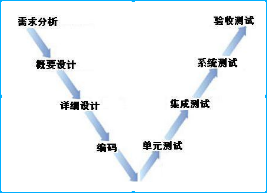

# 软件测试
1. 如何评价别人的行为?
> 表象 -> 分析问题 -> 解决方案

## Chapter 1
1. 软件 = 数据 + 程序 + 文档

2. 软件危机: 软件系统规模 -> 大 复杂程度 -> 大

3. 1968年北大西洋公约组织在联邦德国召开国际会议，第一次讨论软件危机的问题

4. 软件生命周期： 定义->设计->实施->测试->部署->运行->维护

5. 瀑布模型: 
    1. 定义阶段
    	- 计划
    	- 需求分析
    2. 开发阶段
    	- 设计
    	- 编码
    	- 测试
    3. 维护阶段
    	- 运行维护

6. V 模型
  

7. C/S 和 B/S 的区别:

    > c/s是客户机(client)/服务器（server），b/s是浏览器（browser)/服务器。c/s之间通过**任意的协议**通信，一般要求有**特定的客户端**。比如QQ就是[c/s模式](https://www.baidu.com/s?wd=c%2Fs%E6%A8%A1%E5%BC%8F&tn=SE_PcZhidaonwhc_ngpagmjz&rsv_dl=gh_pc_zhidao)，你的桌面上的QQ就是[腾讯公司](https://www.baidu.com/s?wd=%E8%85%BE%E8%AE%AF%E5%85%AC%E5%8F%B8&tn=SE_PcZhidaonwhc_ngpagmjz&rsv_dl=gh_pc_zhidao)的特定的客户端，而服务器就是腾讯的服务器。再比如你看的网络电视也是如此，比如你的桌面上的pplive、Tvcoo等，这些软件都是[c/s模式](https://www.baidu.com/s?wd=c%2Fs%E6%A8%A1%E5%BC%8F&tn=SE_PcZhidaonwhc_ngpagmjz&rsv_dl=gh_pc_zhidao)的，他们要求在用户有特定的客户端。而[B/S模式](https://www.baidu.com/s?wd=B%2FS%E6%A8%A1%E5%BC%8F&tn=SE_PcZhidaonwhc_ngpagmjz&rsv_dl=gh_pc_zhidao)是靠应用层的**http协议**进行通信的（当然也要靠底层的好多协议支持），一般不需要特定的客户端，而是**需要有统一规范的客户端**，那就是你的**浏览器**！Web页就是B/S 模式，也就是说咱们说的网站就是[B/S模式](https://www.baidu.com/s?wd=B%2FS%E6%A8%A1%E5%BC%8F&tn=SE_PcZhidaonwhc_ngpagmjz&rsv_dl=gh_pc_zhidao)。

## Chapter 2
1. 软件测试：是对软件需求分析、设计、编码的最终复查的一系列过程，是软件质量保证的关键步骤。
2. 软件测试目的：
    - 发现缺陷，提高质量
    - 验证是否满足需求
    - 建立软件质量的信心
3. 软件测试的原则: 
    - 测试显示缺陷的存在
    - 穷尽测试是不可能的
    - 测试尽早介入
    - 缺陷集群性（80-20原则）
    - 杀虫剂悖论
    - 测试活动依赖于测试背景
    - 系统有用性
