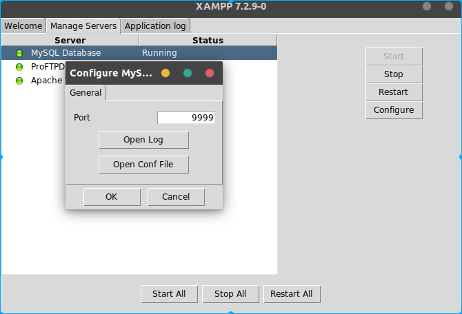
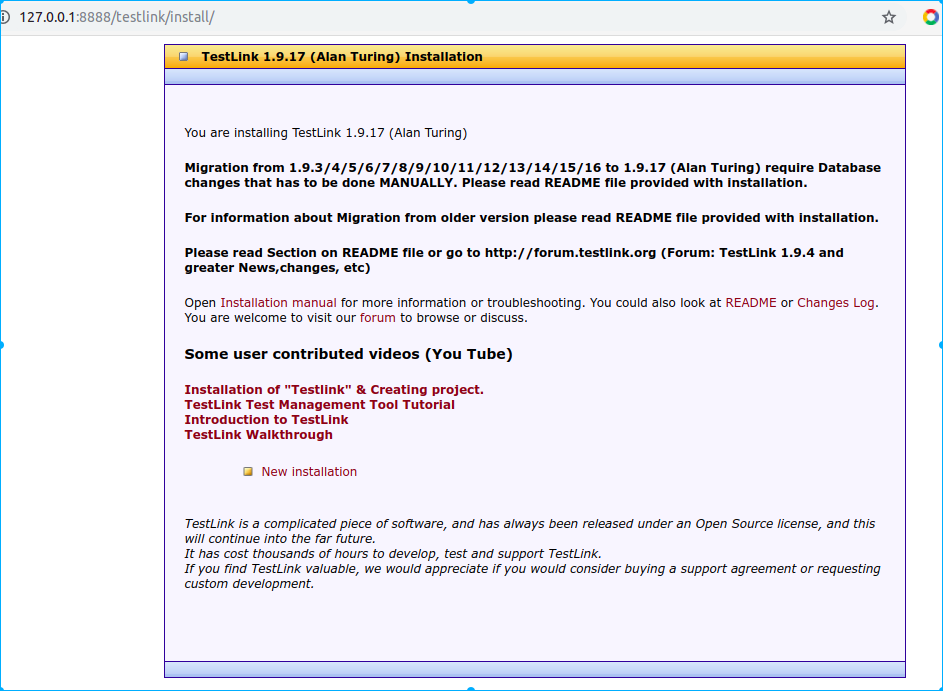
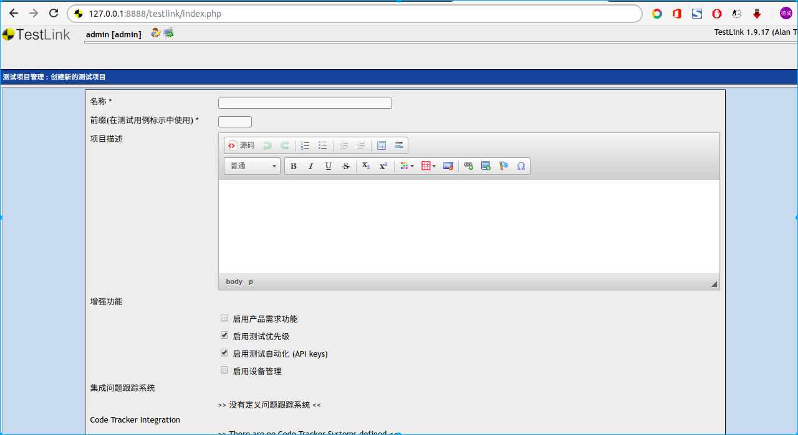

# 搭建软件测试开发环境 XAMPP + TestLink on Ubuntu

## 安装XAMPP
1. 下载 XAMPP for linux 的 64 bit 安装器 https://www.apachefriends.org/index.html
2. 该安装器是个可执行文件，需要添加可执行权限才可以运行
    ```shell
    sudo chmod +x xampp-linux-x64-7.2.9-0-installer.run
    sudo ./xampp-linux-x64-7.2.9-0-installer.run
    ```
3. 等待安装完成然后启动XAMPP,配置Mysql和Apache服务的端口, 并启动服务
    ```
    mysql 9999
    apache 8888
    ```

    

    


4. 在浏览器中访问 http://127.0.0.1:8888

    

5. 启动XAMPP `sudo /opt/lampp/manager-linux-x64.run`

## 安装TestLink

1. 从[官方网站](http://testlink.org)下载最新版的压缩包

    

2. 执行以下命令
    ```shell
    tar -xf testlink-1.9.17.tar.gz
    sudo mkdir -p /opt/lampp/htdocs/testlink
    sudo mv testlink-1.9.17/* /opt/lampp/htdocs/testlink 
    cd /opt/lampp/htdocs/testlink
    sudo chmod 777 gui/templates_c
    sudo chmod 777 logs
    sudo chmod 777 upload_area
    ```
3. 在浏览器访问 http://127.0.0.1:8888/testlink/install/index.php
    
    

4. 点击 New installation, 出现如下界面
    
    

5. 在弹出的页面，勾选”I agree to the terms set out in this licence.”，点击【continue】,出现如下界面
    
    

    说明安装过程中出现了两个错误，这是由于我们配置的目录与默认目录不同，需要重新指定。

    修改 `/opt/lampp/htdocs/testlink/config.inc.php` 文件, 将以下两行注释掉(在行首添加`//`)或删除掉

    ```php
    $tlCfg->log_path ='/var/testlink/logs/';
    $g_repositoryPath='/var/testlink/upload_area/';
    ```

    并将以下两行添加到文件中

    ```php
    $tlCfg->log_path ='/opt/lampp/htdocs/testlink/logs/';
    $g_repositoryPath='/opt/lampp/htdocs/testlink/upload_area/'; 
    ```

    最后，刷新页面，显示刚才的错误都已经被修复掉，页面底部出现了 continue 选项，点击进入下一步。
    
    


6. 如图所示, 填写字段即可
    
    

    

7. 如果出现下图错误，说明我们的数据库用户配置信息没有成功写入到配置文件中，我们需要手动完成这一步骤。
    
    

    在 `/opt/lampp/htdocs/testlink` 该目录下新建文件 `config_db.inc.php`

    ```shell
    vim config_db.inc.php
    ```
    然后将文本域中的php代码添加到 `config_db.inc.php` 中
    ```php
    <?php
    // Automatically Generated by TestLink Installer - Tue, 11 Sep 18 08:17:00 +0200
    define('DB_TYPE', 'mysql');
    define('DB_USER', 'mytestlink');
    define('DB_PASS', '123456');
    define('DB_HOST', 'localhost');
    define('DB_NAME', 'testlink');
    define('DB_TABLE_PREFIX', '');
    ```
    最后修改文件的权限及属主
    ```shell
    sudo chmod 777 config_db.inc.php
    sudo chown 1000:daemon config_db.inc.php
    ```
8. 关掉当前页面，然后访问 testlink 登陆页面 http://127.0.0.1:8888/testlink/login.php
    
    


    使用默认用户名 admin 默认密码 admin 登陆即可

9. 如果你的用户界面是英文显示, 按如下步骤设置中文

    
    
    

    最后，点击页面左上角TestLink Logo返回主页面即可

10. TestLink 主页面如图所示

    

11. 现在，你可以关闭本教程了，Have fun!


    
    


    


    


